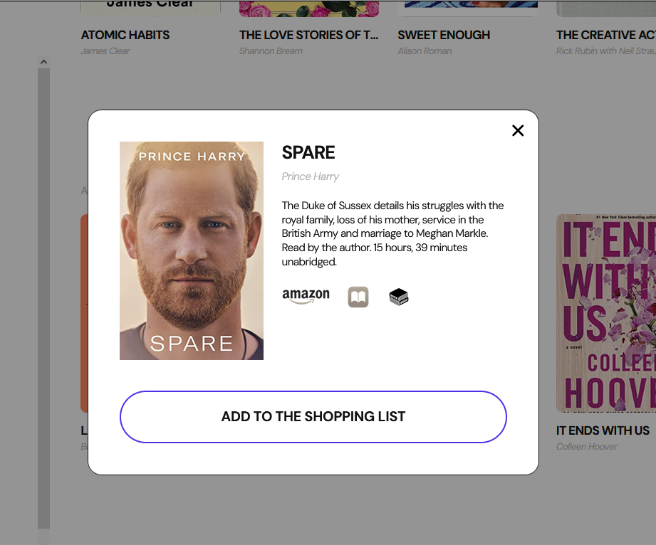
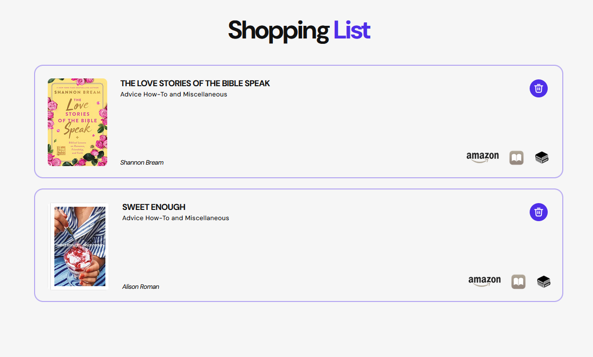

 

  
  
  

<h1 align="left">Bookshelf App</h1>

<h2 align="left">Description</h2>

Bookshelf App is an application for book worms that gives a possibility to browse through books according to their categories, read the full information about the book you like in the pop up window and add this book to your shopping list or click the link to the book store and buy the book immediately.

<h2 align="left">Features</h2>

The application consists of 2 pages: 
• <strong>"Home"</strong> page is divided into two parts: list of book categories and the virtual bookshelves with books sorted by categories. 
• <strong>"Shopping list"</strong> page, which contains a list of saved books for future shopping.

<h3 align="left">Technologies Used</h3>
<strong>Frontend:</strong> JavaScript, CSS, HTML, SASS, Parcel, REST API 
